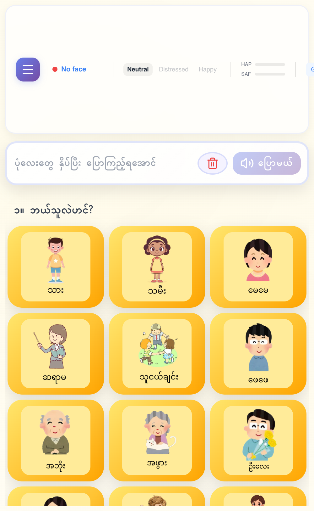

# ပြောစမ်းပါ — Burmese AAC Communication App 🇲🇲

An **Augmentative and Alternative Communication (AAC)** web app for **Burmese-speaking autistic children**. Users build sentences by tapping emoji + text cards (Subject → Verb → Object), which are spoken aloud using Burmese text-to-speech.

> **🏆 Hackathon MVP** — Built for Myanmar's autistic community.

---

## ✨ Features

| Feature | Description |
|---------|-------------|
| 🗣️ **Sentence Builder** | Tap cards in a grammar-guided flow (Subject → Verb → Object) to build full Burmese sentences |
| 🔊 **Text-to-Speech** | Burmese speech via `edge-tts` (Microsoft Azure Neural) with gTTS fallback |
| 🤖 **AI Image Captioning** | Upload a photo → Claude captions it + translates to Burmese automatically |
| 💡 **AI Sentence Suggestions** | Context-aware suggestions based on time of day, recent taps, and detected mood |
| ⭐ **Favorites** | Save frequently used icons for quick access |
| 📊 **Analytics Dashboard** | Track sentence usage, word frequency, and communication patterns over time |
| 🔒 **Caregiver Portal** | Math-protected settings panel for parents & teachers |
| 🖼️ **Custom Cards** | Parents can upload custom photo cards with recorded voice |
| 📖 **1-Minute Bedtime Stories** | Record and play short Burmese bedtime stories |
| 🎮 **Animal Memory Game** | Fun concentration game with animal cards |
| 😊 **Emotion Detection** | Camera-based mood detection adjusts available card categories |
| 📋 **Visual Routines** | Create and follow step-by-step visual routines |
| 🔐 **Auth System** | Session-based login for caregivers |

---

## 🖼️ Screenshot



---

## 🚀 Quick Start

### Prerequisites

- Python 3.12+
- Node.js 18+
- npm

### 1. Clone & Install

```bash
# Backend
pip install -r requirements.txt

# Frontend
cd frontend && npm install
```

### 2. Environment Variables

Copy `.env.example` to `.env`:

| Variable | Required | Description |
|----------|----------|-------------|
| `ANTHROPIC_API_KEY` | ✅ | Claude API key (vision/translation/suggestions) |
| `ANTHROPIC_BASE_URL` | ❌ | Claude API base URL (default: `https://api.anthropic.com`) |
| `ELEVENLABS_API_KEY` | ❌ | ElevenLabs TTS API key (not required — falls back to `edge-tts`) |
| `SUPABASE_URL` | ❌ | Supabase project URL (optional — falls back to local JSON DB) |
| `SUPABASE_KEY` | ❌ | Supabase anon/public key (optional) |
| `SECRET_KEY` | ✅ | Flask session secret |

> **Zero-config mode**: Without Supabase credentials, the app uses `local_db.json` for storage — perfect for local development.

### 3. Run

```bash
# Terminal 1 — Backend (Flask on :5001)
python app.py

# Terminal 2 — Frontend (Vite on :5173)
cd frontend && npm run dev
```

Open **http://localhost:5173** in your browser.

---

## 🏗️ Architecture

```
┌──────────────┐     /api/* proxy     ┌──────────────┐     ┌─────────────┐
│  React 19     │ ◄──────────────────► │  Flask API    │ ◄──► │  Supabase   │
│  + TypeScript │    Vite Dev Server   │  (Python)     │      │  PostgreSQL │
│  + Vite       │     localhost:5173   │  :5001        │      │  (optional) │
└──────────────┘                       └──────┬───────┘      └─────────────┘
                                              │
                                     ┌────────▼────────┐
                                     │  OpenAI / Claude  │
                                     │  (Vision + TTS)   │
                                     └─────────────────┘
```

### Tech Stack

| Layer | Technology |
|-------|-----------|
| **Frontend** | React 19, TypeScript, Vite 8, Lucide Icons, `face-api.js` |
| **Backend** | Flask 3, Python 3.12, Gunicorn |
| **Database** | Supabase (PostgreSQL) with local JSON fallback |
| **AI** | Anthropic Claude (`mimo-v2.5-pro` for vision + translation, sentence suggestions) |
| **TTS** | `edge-tts` (Azure Neural) + gTTS fallback + browser SpeechSynthesis |
| **Deployment** | Vercel (serverless) |

### Project Structure

```
/
├── app.py                 # Flask app — all REST routes
├── ai_module.py           # Claude API + TTS integrations
├── db.py                  # Supabase client + local JSON fallback
├── wsgi.py                # Vercel WSGI entry point
├── vercel.json            # Vercel config
├── requirements.txt       # Python deps
├── local_db.json          # Local JSON database (auto-created)
├── supabase/migrations/   # SQL schema + seed data
├── frontend/
│   ├── src/
│   │   ├── App.tsx        # Main app component
│   │   ├── api.ts         # API client
│   │   ├── data.ts        # Card definitions + grammar rules
│   │   ├── main.tsx       # React entry point
│   │   ├── index.css      # All styles
│   │   └── components/    # React components
│   ├── vite.config.ts     # Vite config (proxy :5173 → :5001)
│   └── package.json
└── docs/                  # Documentation & screenshots
```

---

## 📡 API Endpoints

| Method | Path | Auth | Purpose |
|--------|------|------|---------|
| GET | `/api/health` | — | Health check |
| POST | `/api/auth/login` | — | Login |
| POST | `/api/auth/logout` | — | Logout |
| POST | `/api/auth/register` | — | Register |
| GET | `/api/categories` | — | List icon categories |
| GET | `/api/icons?category_id=` | — | List icons (optionally filtered) |
| GET | `/api/tts?text=` | — | Burmese TTS → MP3 audio |
| POST | `/api/ai/process_image` | — | Upload image → Claude caption + Burmese |
| POST | `/api/ai/suggest_sentences` | — | Sentence suggestions (time/mood-aware) |
| POST | `/api/ai/summarize` | — | Summarize Burmese conversation |
| POST | `/api/favorites/toggle` | ✅ | Toggle favorite icon |
| GET | `/api/favorites` | ✅ | List favorites |
| POST | `/api/sentences/save` | — | Save sentence |
| GET | `/api/sentences/recent` | ✅ | Recent sentences (paginated) |
| GET | `/api/analytics/sentences` | ✅ | Sentence usage analytics |
| GET/POST | `/api/routines` | ✅ | List/create visual routines |
| DELETE | `/api/routines/<id>` | ✅ | Delete routine |
| GET/POST | `/api/cards/custom` | — | Create/list custom cards |
| PUT/DELETE | `/api/cards/custom/<id>` | — | Update/delete custom card |

---

## 🧠 How the Sentence Builder Works

The app uses a **3-step grammar flow** designed for Burmese sentence structure:

1. **Step 1: Who? (Subject)** — People, pronouns ("အမေ", "သား")
2. **Step 2: What? (Object)** — Food, feelings, places, actions ("ရေ", "ပျော်တယ်")
3. **Step 3: Do what? (Verb)** — Eat, drink, go ("စားမယ်", "သောက်မယ်")

**Grammar rules** (defined in `data.ts` via `CATEGORY_ROLE` map):
- Some categories (actions like "ပြေးမယ်") **auto-finish** the sentence — no verb needed
- Shortcut cards ("ရေသောက်မယ်", "အရေးပေါ်ကူညီပါ") complete immediately on tap
- The built sentence is spoken aloud via Burmese TTS and saved to the database

---

## 🗄️ Database Schema

**6 categories** with ~40 seed icons across food, feelings, actions, verbs, places, people, body & health.

| Table | Purpose |
|-------|---------|
| `categories` | Icon categories (people, food, actions, etc.) |
| `icons` | Individual AAC cards with emoji/URL + Burmese + English labels |
| `users` | Caregiver accounts (username + hashed password + role) |
| `favorites` | User-favorited icon mappings |
| `sentences` | Built sentence history |
| `routines` | Visual routine definitions |
| `routine_steps` | Individual steps within a routine |

Full schema: `supabase/migrations/001_initial_schema.sql`

---

## 🛠️ Development

```bash
# Lint frontend
cd frontend && npm run lint

# Build frontend for production
cd frontend && npm run build

# Run backend via gunicorn (production-like)
gunicorn wsgi:application

# macOS note: port 5000 is used by AirPlay Receiver — Flask runs on :5001
```

---

## 🤝 Contributing

This is a hackathon project focused on serving **Burmese-speaking autistic children and their families**. Contributions, feedback, and translations are welcome!

---

## 📄 License

MIT — Built with ❤️ for the AAC community in Myanmar.
